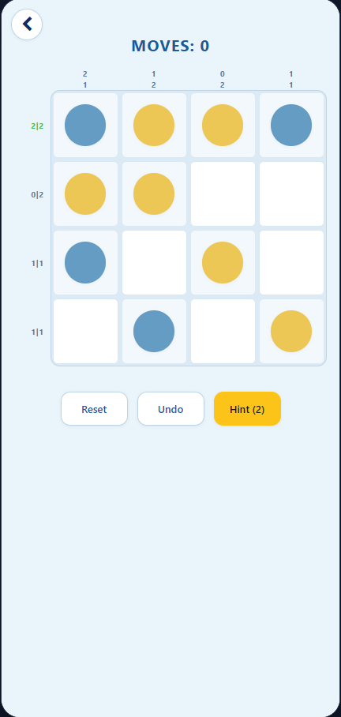
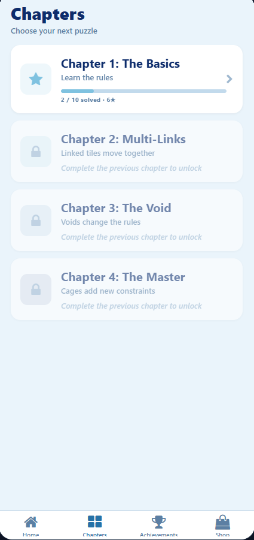

# TwinTiles 🧩

**Cross-platform puzzle game built with React Native, Expo and TypeScript.**

TwinTiles is a grid-based puzzle game where players complete increasingly challenging levels while following a set of logical constraints. The project was developed as a substantial application project, with a focus on reusable React components, game-state management, custom validation logic, persistent player progress and cross-platform deployment.

## 📸 Showcase

<p align="center">
  
</p>

### Interface

|                           Gameplay                           |                            Level Progression                            |
| :----------------------------------------------------------: | :---------------------------------------------------------------------: |
|  |  |

---

## 🚀 Live Demo

**Web version:**
https://phenomenal-basbousa-07227e.netlify.app/

> The web deployment provides a browser-based version of the application. The primary application was designed for mobile interaction and can also be run through Expo on iOS and Android.

---

## ✨ Features

### Puzzle System

* Interactive tile-based puzzle boards with multiple game rules and constraints.
* Custom validation logic checks the player's board state as tiles are changed.
* Prevents invalid three-tile sequences across rows and columns.
* Validates balanced tile counts within rows and columns.
* Supports additional puzzle mechanics including linked groups and specialised level rules.
* Provides immediate feedback when a completed board satisfies the required conditions.

### Progression

* Chapter and level-based progression system.
* Level completion and star-based scoring.
* Persistent tracking of completed levels and earned stars.
* Daily puzzle functionality with separate daily progression.
* Unlockable achievements and in-game progression systems.

### Player Data

* Persistent local storage using AsyncStorage.
* Saves level progress, stars, coins, achievements and other player state between sessions.
* Handles separate progression data for different game modes.

### User Experience

* Responsive interface designed around mobile interaction.
* Multiple visual themes.
* Interactive menus for levels, upgrades and game progression.
* Haptic and audio feedback where supported.
* Animations and visual feedback for important game events.

---

## 🧠 Technical Implementation

### Custom Puzzle Validation

A core part of TwinTiles is the validation system used to determine whether a player's board satisfies the game's rules.

The validation logic evaluates:

* Horizontal and vertical three-in-a-row conditions.
* The number of each tile type within rows and columns.
* Special/void cells that are excluded from relevant calculations.
* Additional level-specific constraints.
* Completed board states before allowing a level to be marked as solved.

This required the game state to be evaluated dynamically as players modify individual cells rather than relying solely on predefined solutions.

### State Management

React state and context-based systems are used to manage application-wide data such as:

* Current puzzle state
* Player progression
* Coins
* Achievements
* Themes
* Haptics and audio preferences
* Daily puzzle state

Reusable components are used throughout the application to separate game logic from presentation and keep the interface maintainable.

### Persistent Storage

Player progress is persisted locally using `AsyncStorage`.

Stored information includes:

* Completed levels
* Stars
* Coins
* Achievements
* Level states
* Daily puzzle progress
* User preferences

This allows players to close and reopen the application without losing their progression.

---

## 🛠️ Technology Stack

| Technology       | Purpose                                  |
| ---------------- | ---------------------------------------- |
| **React Native** | Cross-platform application UI            |
| **Expo**         | Development and application tooling      |
| **TypeScript**   | Type-safe application and game logic     |
| **AsyncStorage** | Local persistence                        |
| **JavaScript**   | Application runtime and supporting logic |
| **Metro**        | React Native bundling                    |
| **Netlify**      | Web deployment                           |
| **Git / GitHub** | Version control                          |

---

## 📁 Project Structure

The application is organised into reusable components and supporting modules rather than placing the game logic inside a single screen.

Key areas include:

```text
TwinTiles/
├── assets/
├── components/
├── contexts/
├── screens/
├── utils/
├── ...
```

The exact structure may change as the project develops, but the application separates UI components, state management, game logic and supporting utilities to make individual systems easier to maintain.

---

## 💻 Running Locally

### Prerequisites

* Node.js 18+
* npm
* Expo CLI / Expo tooling
* Expo Go for physical-device testing (optional)

### 1. Clone the repository

```bash
git clone https://github.com/lolalolabob123/TwinTiles.git
cd TwinTiles
```

### 2. Install dependencies

```bash
npm install
```

### 3. Start the development server

```bash
npx expo start
```

From the Expo development server, the application can be opened using:

* **Expo Go** on a physical iOS or Android device
* An Android emulator
* An iOS simulator
* A supported web browser

---

## 🧪 Testing & Debugging

Development involved testing the puzzle rules and application behaviour across different board configurations and player interactions.

Particular attention was given to:

* Puzzle validation edge cases.
* Invalid board configurations.
* Level-generation constraints.
* Persistence between application sessions.
* Different screen sizes and orientations.
* Navigation and progression between levels.
* Daily and standard game modes.

The project was developed iteratively using Git, allowing changes to individual systems to be tracked and debugged throughout development.

---

## 📱 Platform Support

TwinTiles was developed using React Native and Expo with the intention of sharing application logic across platforms.

| Platform | Support |
| -------- | ------- |
| Android  | ✅       |
| iOS      | ✅       |
| Web      | ✅       |

The web version is primarily provided as an accessible demonstration of the application.

---

## 🎯 Project Goals

The main goals of the project were to:

* Build a complete interactive application rather than an isolated prototype.
* Develop reusable React Native components.
* Apply TypeScript to a larger application codebase.
* Implement non-trivial game validation and state-management logic.
* Persist user data between sessions.
* Create a consistent experience across supported platforms.
* Deploy a working version that can be accessed without installing the application.

---

## 📚 What I Learned

Developing TwinTiles provided practical experience with:

* Building larger React Native applications.
* Structuring reusable components.
* Managing complex application state.
* Writing and debugging custom validation algorithms.
* Working with TypeScript in a multi-feature project.
* Persisting application data locally.
* Designing interfaces for touch-based interaction.
* Handling platform differences between mobile and web.
* Using Git throughout iterative development.
* Deploying a React Native/Expo application for browser-based demonstration.

---

## 🔗 Links

**Live Demo:**
https://phenomenal-basbousa-07227.netlify.app/

**Repository:**
https://github.com/lolalolabob123/PuzzleGameProject

**Developer:**
Callum Candy
