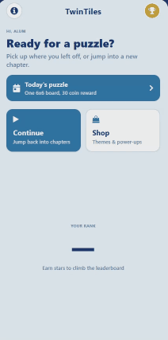

# TwinTiles — Cross-Platform Mobile Puzzle Game 🧩

## 📸 Game Showcase

<!-- Hero GIF -->
<p align="center">
  
</p>

<br />

### 📱 Interface Highlights

| Main Game Grid | Level Progression & Shop |
| :---: | :---: |
|  |  |

---

**TwinTiles** is a cross-platform mobile puzzle game engineered with **React Native**, **Expo**, and **TypeScript**. Built with custom grid-traversal algorithms, persistent local storage, and high-performance WebGL/Metro canvas wrapping, the game challenges players to navigate complex tile arrangements while obeying strict layout and adjacency rules.

🚀 **Live Web Emulation:** [phenomenal-basbousa-07227e.netlify.app](https://phenomenal-basbousa-07227e.netlify.app/)  
📂 **GitHub Repository:** [github.com/lolalolabob123/PuzzleGameProject](https://github.com/lolalolabob123/PuzzleGameProject)

---

## 🌟 Key Technical Features

* **Custom Grid-Traversal Validation Algorithm:** Enforces strict game logic where no more than two tiles of the same color can sit directly adjacent to each other—evaluating both static board states and dynamic player inputs in real time.
* **Persistent Session Storage:** Saves user progress, coin balances, level completions, and unlocked achievements locally using Expo/AsyncStorage mechanisms.
* **Responsive Desktop Web Wrapper:** Deployed via Netlify and Metro Bundler using zero-clipping canvas wrappers to simulate an authentic mobile viewport on desktop screens.
* **Cross-Platform Architecture:** Built on React Native and TypeScript for fully unified execution across iOS, Android, and Web platforms.

---

## 🛠️ Tech Stack

### **Core Frameworks & Tools**
* **React Native** (Cross-platform UI engine)
* **Expo** (Toolchain & build workflow)
* **TypeScript** (Static typing & algorithm safety)
* **AsyncStorage** (Local client-side persistence)

### **Deployment & Testing**
* **Metro Bundler** (JS/TS module bundling)
* **Netlify** (Production web deployment host)
* **Git & GitHub** (Version control)

---

## 💻 Running the Project Locally

Follow these steps to set up and run TwinTiles on your local machine.

### **Prerequisites**
* Node.js (v18+)
* npm or yarn
* Expo Go app on iOS/Android (optional, for physical device testing)

### **1. Clone the Repository**
```bash
git clone [https://github.com/lolalolabob123/PuzzleGameProject.git](https://github.com/lolalolabob123/PuzzleGameProject.git)
cd PuzzleGameProject
